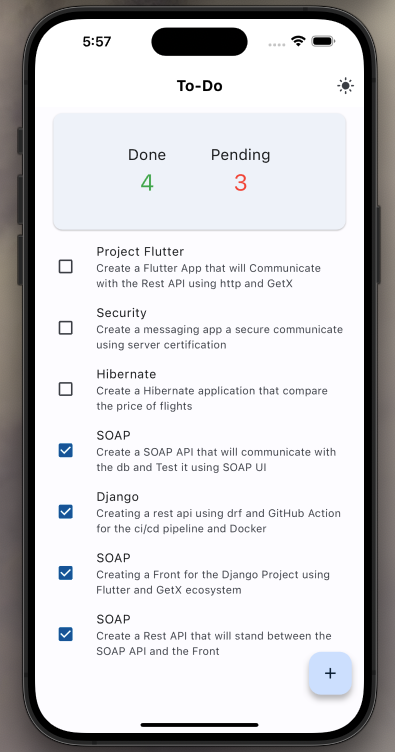
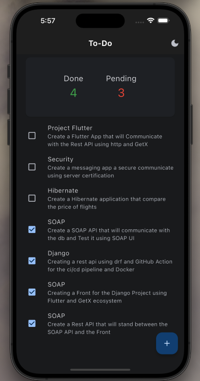

# To-Do APP

To-Do App is an application that allows users to create, manage and organize their tasks. It create using **java** and **flutter** and using **Rest** and **SOAP**.

## Implementation

1. I have created the [docker-compose](docker-compose.yml) file that contains 2 services **PostgreSQL** database and **Adminer** it UI for the database like **phpMyAdmin** and the [init-db](init-db.sql) file that will create the database.

```
docker-compose up --build
```

this command will build and run the container. 2. I have created the [todo_SOAP](todo_SOAP/) project that contains the [dbconnection](todo_SOAP/src/main/java/org/example/db/DbConnection.java) and [Todo model](todo_SOAP/src/main/java/org/example/model/Todo.java) and [DAO](todo_SOAP/src/main/java/org/example/dao/) and the [SOAP Service](todo_SOAP/src/main/java/org/example/service/) and [ServicePublisher](todo_SOAP/src/main/java/org/example/service/TodoServicePublisher.java) that will publish the SOAP API. 3. I have created the [Rest API project](todo_Rest/) and I have created SOAP client using this command:

```
wsimport -keep -verbose http://localhost:3334/todoService?wsdl -p org.example.soapclient -d src/main/java
```

This command will create a [soap client](todo_Rest/src/main/java/org/example/soapclient/) a generate classes for the methods in the SOAP API. And I have created the [Model](todo_Rest/src/main/java/org/example/model/TodoModel.java) and the [Service](todo_Rest/src/main/java/org/example/service/) that communicate with the soap api and the [Controller](todo_Rest/src/main/java/org/example/controller/) and [Published](todo_Rest/src/main/java/org/example/App.java) the Rest API. 4. I have created the [Flutter app](todo_flutter) using terminal:

```
flutter create --plateforms=ios,android,web todo_flutter
```

and I have installed the **GetX** and **http** package for state management and route management and http for communicating with the **Rest API** using this command:

```
flutter pub add get http
```

and I have created the file structure of the project:

```
lib/
|-- main.dart
|-- routes.dart
|-- constants.dart
|-- service/
|-- controller/
|-- model/
|-- view/
```

Then I have created the **Screens** and then i have created the **logic**.

## Screens
- Home Screen
<p align="center">
  
   
</p>